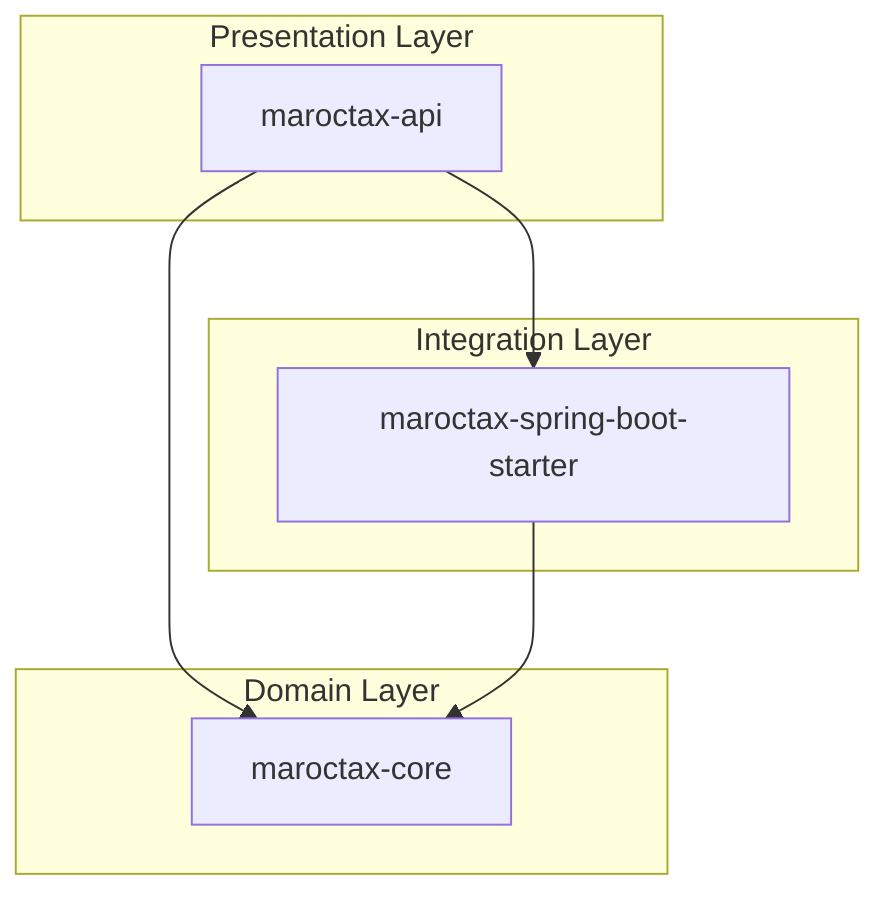
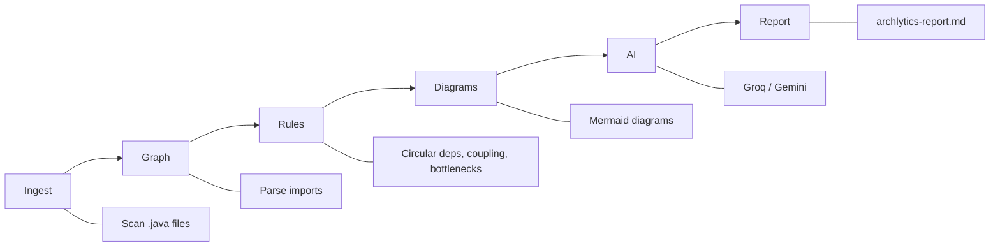

# Archlytics

**AI Software Architect for Java codebases**

Archlytics reads a Java repository, builds a module dependency graph, detects architectural violations with deterministic rules, generates Mermaid diagrams, and uses an LLM to interpret system design risks and scaling bottlenecks.

> Static analysis first, AI second — the graph is built from imports, not guessed from source code.

---

## Example output

Analysis of a 3-module Maven project ([maroctax](https://github.com/Hamza-spc/maroctax)):

```text
Java files: 28
Modules: 3
Violations: 6
Longest chain: maroctax-api → maroctax-spring-boot-starter → maroctax-core

[HIGH]   Shared kernel bottleneck — maroctax-core depended on by 2 modules
[MEDIUM] Layer bypass — api depends on core while also using starter
[MEDIUM] Serial dependency chain — 3-hop synchronous path
```

### Layer view (auto-generated)



See [docs/sample-report.md](docs/sample-report.md) for a full example report.

---

## Pipeline



| Stage | What it does |
|-------|----------------|
| **Ingest** | Walks the repo, skips `target/`, `node_modules`, etc. |
| **Graph** | Regex-parses `import` statements, resolves internal types, groups by Maven module |
| **Rules** | Circular dependencies, high coupling, shared-kernel bottlenecks, layer bypasses |
| **Diagrams** | Module graph, layer view, critical path — deterministic, no AI |
| **AI** | Architecture summary, scaling risks, recommendations (Groq or Gemini) |
| **Report** | Markdown with violations, metrics, and embedded Mermaid |

---

## Quick start

**Requirements:** Java 21+, Maven 3.9+

```bash
git clone https://github.com/Hamza-spc/Archlytics.git
cd Archlytics

# Configure AI (optional — diagrams + rules work without it)
cp .env.example .env
# Edit .env and add GROQ_API_KEY from https://console.groq.com

mvn -q package
java -jar target/archlytics-0.1.0-SNAPSHOT.jar /path/to/your/java/repo
```

Output is written to `archlytics-report.md` in the current directory.

### CLI options

```bash
# Custom report path
java -jar target/archlytics-0.1.0-SNAPSHOT.jar ./my-repo -o report.md

# Skip AI — graph, rules, and diagrams only (no API key needed)
java -jar target/archlytics-0.1.0-SNAPSHOT.jar ./my-repo --skip-ai
```

---

## Configuration

Create a `.env` file in the project root (never commit it):

```env
AI_PROVIDER=groq
GROQ_API_KEY=gsk_your_key_here

# Optional
# GROQ_MODEL=llama-3.3-70b-versatile
# GEMINI_API_KEY=...        # alternative provider
# AI_PROVIDER=gemini
```

| Variable | Description |
|----------|-------------|
| `AI_PROVIDER` | `groq` or `gemini` (auto-detected from keys if omitted) |
| `GROQ_API_KEY` | Free key from [console.groq.com](https://console.groq.com) |
| `GROQ_MODEL` | Default: `llama-3.3-70b-versatile` |
| `GEMINI_API_KEY` | Free key from [Google AI Studio](https://aistudio.google.com/apikey) |

---

## What it detects

### Deterministic rules (no AI)

- **Circular dependencies** — module cycles like `A → B → C → A`
- **High coupling** — modules or files with excessive fan-in / fan-out
- **Shared kernel bottleneck** — one module depended on by many others
- **Layer bypass** — entry module skipping an intermediate layer
- **Serial dependency chains** — deep synchronous call paths
- **Entry fan-out** — API layer depending on multiple backends

### AI interpretation

- Architecture type (e.g. layered modular monolith)
- System design issues with impact levels
- Scaling scenarios (10x traffic, concurrency spikes)
- Actionable refactor recommendations

---

## Project structure

```
src/main/java/com/archlytics/
├── cli/           # Picocli entry point
├── ingest/        # File scanner
├── graph/         # Import parser, dependency graph, metrics
├── rules/         # Violation detection engine
├── report/        # Mermaid diagrams + markdown report
├── ai/            # Groq / Gemini clients
└── config/        # .env loader
```

---

## Development

```bash
mvn test          # run unit tests
mvn package       # build shaded JAR
```

---

## Design philosophy

Most coding assistants work at the **file level**. Archlytics works at the **system level**:

| Coding assistant | Archlytics |
|------------------|------------|
| Edits a function | Maps module boundaries |
| Fixes a bug | Detects architectural drift |
| Generates code | Generates architecture diagrams |
| Local context | Whole-repo dependency graph |

**Deterministic parsing builds the facts. AI interprets them.** That separation keeps findings auditable and reduces hallucination.

---

## License

MIT
