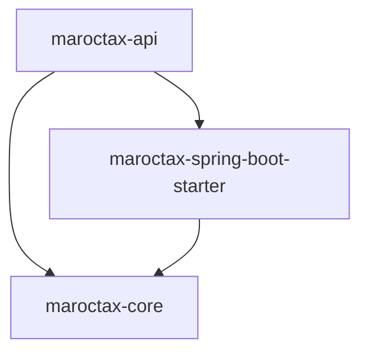
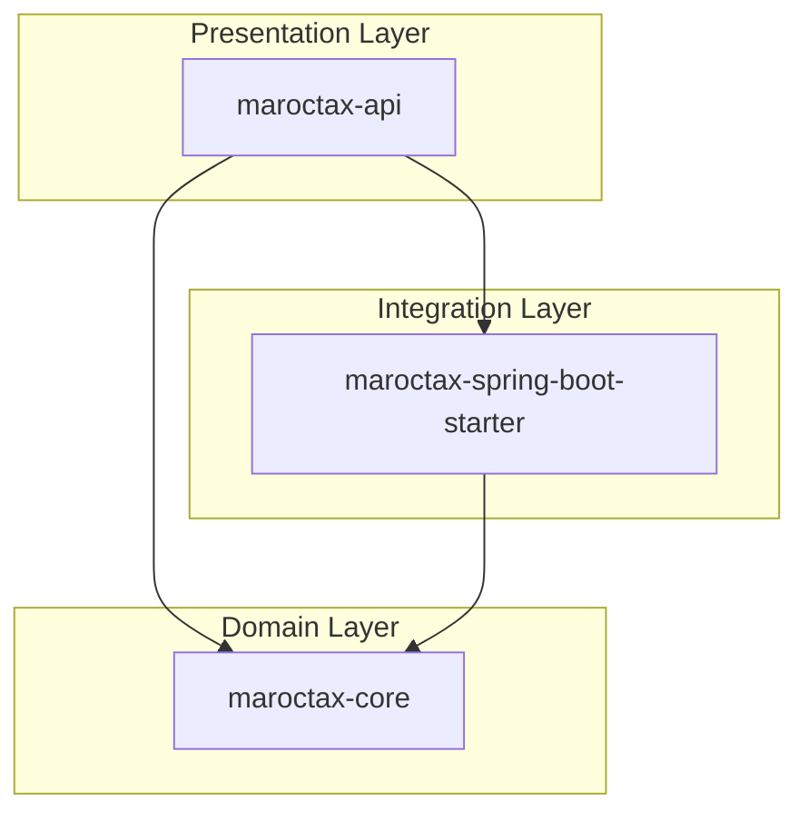

# Sample Architecture Report

Example output from analyzing a 3-module Java Maven project.

**Repository:** `maroctax` (28 Java files)  
**Architecture type:** Layered modular monolith

---

## Summary

The codebase is structured as a layered modular monolith with three modules: `maroctax-api`, `maroctax-core`, and `maroctax-spring-boot-starter`. The API module serves as the entry point. Core acts as a shared kernel with high fan-in, indicating potential scaling bottlenecks under load.

## Graph Metrics

- **Longest dependency chain:** maroctax-api → maroctax-spring-boot-starter → maroctax-core
- **Entry points:** maroctax-api
- **Shared-kernel hubs:** maroctax-core
- **Layer bypasses:** maroctax-api depends directly on maroctax-core while also using maroctax-spring-boot-starter

## Violations

| Severity | Issue |
|----------|-------|
| HIGH | Shared kernel bottleneck — maroctax-core depended on by 2 modules |
| MEDIUM | Layer bypass — api skips starter layer for core access |
| MEDIUM | Serial dependency chain — 3-module synchronous path |
| LOW | PayrollController imports 8 internal types |
| LOW | MarocTaxService imports 8 internal types |
| LOW | Entry module fans out to 2 backends |

## Scaling & Bottleneck Analysis

### 10x traffic increase
- **Risk:** maroctax-core becomes a performance bottleneck (shared kernel)
- **Mitigation:** Cache hot paths, split core into smaller deployable units

### Peak concurrent requests
- **Risk:** Deep chain (api → starter → core) adds end-to-end latency
- **Mitigation:** Async boundaries between layers where possible

## Architecture Diagrams

### Module Dependencies

### Layer View

### Critical Path

---

*Generated by Archlytics — run `java -jar archlytics.jar /your/repo` to analyze your own project.*
